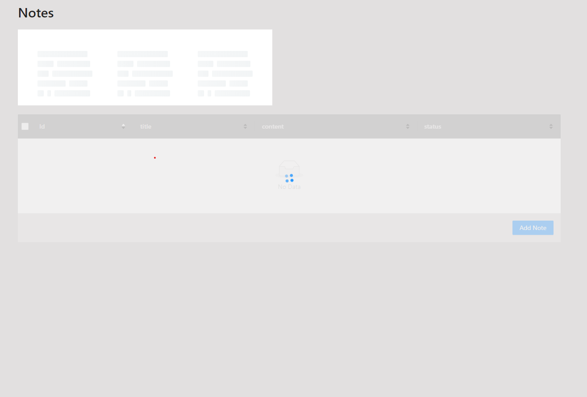
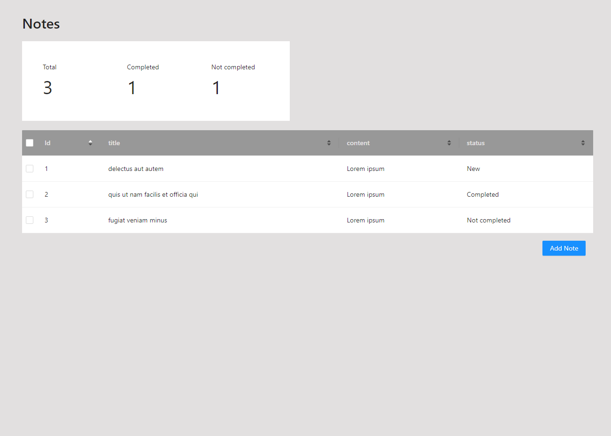
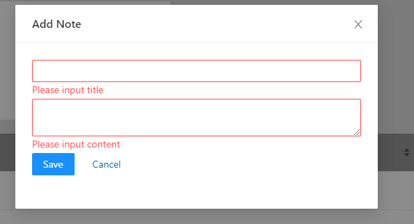
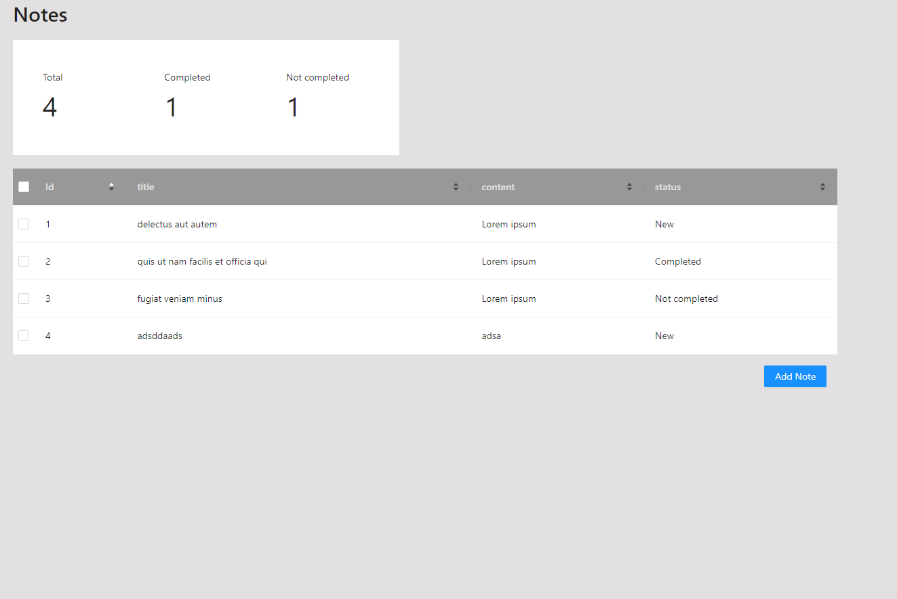
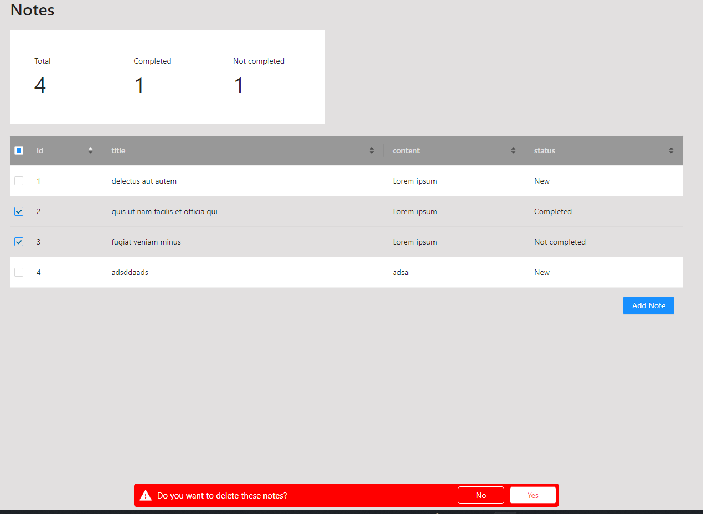
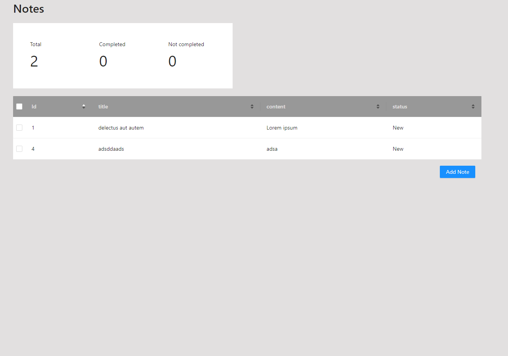

# Homework
Homework-VueJs-nestJs

Project contains Vue3 framework and component design made with Ant design

- Ant design was easiest and closest to spec design. I also have used it earlier.
- I took Vue 3 over Vue 2 to test if Vue 3 is ready. For this project it worked well and Vite keeped compiling it fast.
- Testing made with jest and cypress. I used jest for server endpoint testing and cypress for front end end to end testing. Testing has one single story kind of approach.
- Nestjs is good modular framework for node server and it uses under the hood express as default. Nestjs gives good validation which is importat keeping server data clean. Also swagger is easy to setup, but I didn't fill every part of it.
- I didn't use real DB for this project because it would be out of scope. So I mock data is hardcoded to server.

## Client
[Client](./client)

## Server
[Server](./server)

Fetching server

Default look

validations

Added new Note

Selected notes to delete

Selected notes are deleted
