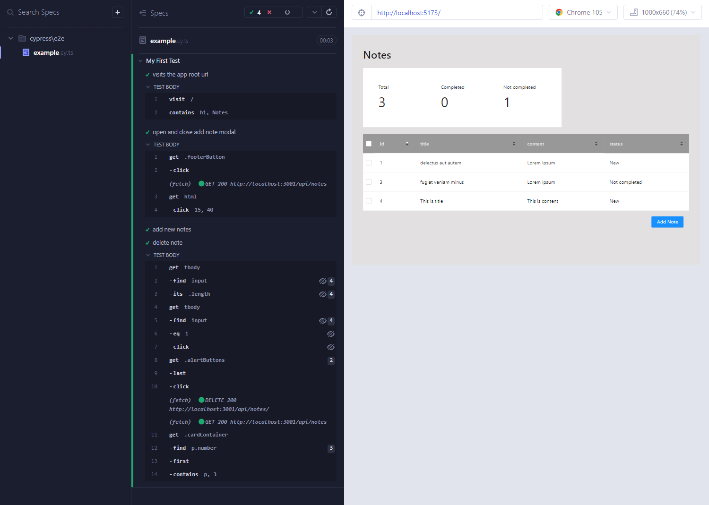

# Homework Vue application

Application user nestjs server to fetch data. App uses Ant desing to speed up creating app and also gives 
- validations for inputs
- data table with sorting and selecting boxes
- responsive outlook
- components ready for homework design
- loaders and placeholders are already made if there is no data.

I didn't use .ENV file for this, so this is more testable, also added all the packages for package.json. so npx is not need.

I used Pinia as data management which is better version of Vuex, without string dispatching. Actions and mutations are merged.

I didn't setup axios for this project, but I used fetch, because cypress can use easily fetch.
There could be better error handling, like user could see better if server communication has error.
I didnt see this useful for this task, but could be made with more time.

Folder structure is made simple, but if this project would continue there would be views, pages and more utilities.
Right now components contains most of the business logic. All this could be made more common, if there could be more design.

Coloring is made close, but I didnt get best colors from pdf file.

## Installation

```bash
$ npm install
```

## Running the app

```bash
# development
$ npm run dev
```

## Cypress
I made single story test, where user test modal can be closed, can create new note and then delete random note.
Also check total notes count works



```bash
# development
$ npm run dev

# and other terminal
$ npm run test:e2e
# or in terminal
$ npm run test:e2e:ci

```